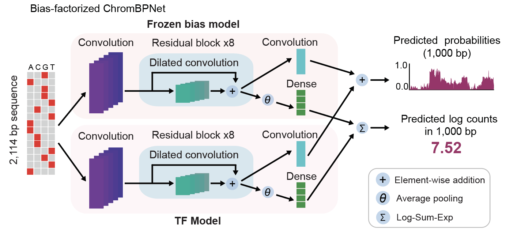
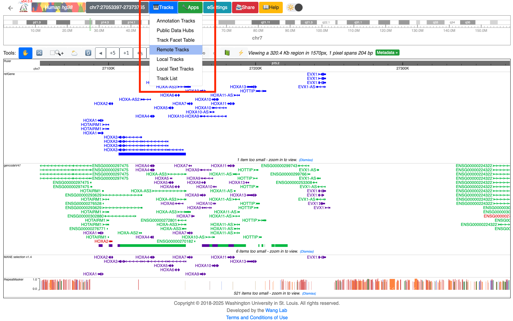
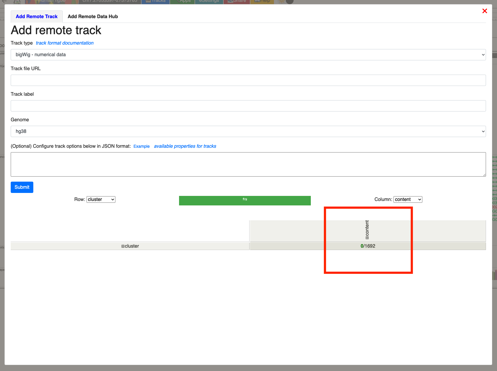
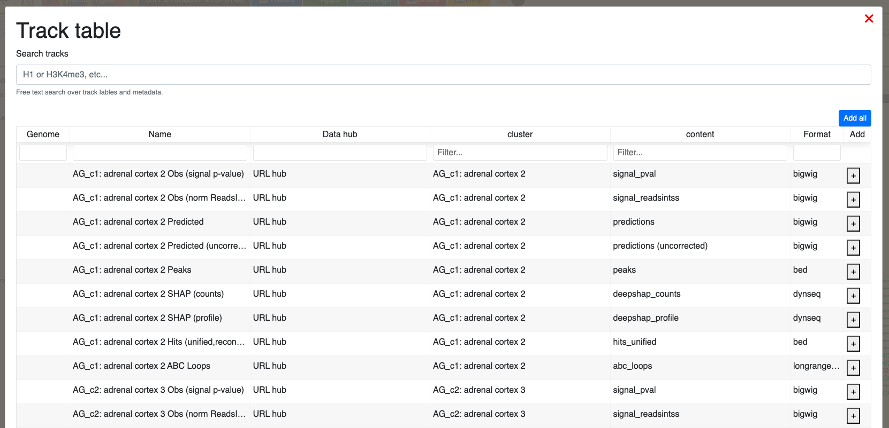

# Data download and descriptions

This file provides more detailed description of the data and analysis products deposited on Zenodo at
[https://zenodo.org/communities/hdma](https://zenodo.org/communities/hdma), and demonstrates how to programmatically search for
and download specific files.  

- A description of all data types and the corresponding URL
and DOI is provided in Table S14 of the manuscript 
- This documentation explains data _formats_,
but please see the Methods section of the manuscript for details on how these were generated
or computed

Contents:

- [Downloading data from Zenodo](https://greenleaflab.github.io/HDMA/DATA.html#downloading-data-from-zenodo)
  - [General use](https://greenleaflab.github.io/HDMA/DATA.html#general-use)
  - [Helper function](https://greenleaflab.github.io/HDMA/DATA.html#helper-function)
  - [e.g. get trained ChromBPNet models for brain cell types](https://greenleaflab.github.io/HDMA/DATA.html#example-get-trained-chrombpnet-models-for-brain-cell-types)
  - [e.g. get the Seurat object for brain tissue](https://greenleaflab.github.io/HDMA/DATA.html#example-get-the-seurat-object-for-brain-tissue)
  - [e.g. get all fragment files](https://greenleaflab.github.io/HDMA/DATA.html#example-get-all-fragment-files)
  - [e.g. get bigwigs for all immune cell types](https://greenleaflab.github.io/HDMA/DATA.html#example-get-bigwigs-for-all-immune-cell-types)
- [Fragment files and count matrices](https://greenleaflab.github.io/HDMA/DATA.html#fragment-files-and-count-matrices)
- [Seurat objects](https://greenleaflab.github.io/HDMA/DATA.html#seurat-objects)
- [ArchR projects](https://greenleaflab.github.io/HDMA/DATA.html#archr-projects)
- [BPCells object](https://greenleaflab.github.io/HDMA/DATA.html#bpcells-object)
- [Trained ChromBPNet models](https://greenleaflab.github.io/HDMA/DATA.html#trained-chrombpnet-models)
- [ChromBPNet mean contribution scores](https://greenleaflab.github.io/HDMA/DATA.html#chrombpnet-mean-contribution-scores)
- [Bigwig tracks for observed and predicted accessibility and contrib. scores](https://greenleaflab.github.io/HDMA/DATA.html#bigwig-tracks-for-observed-and-predicted-accessibility-and-contrib-scores)
- [Motif lexicon and motifs per cell type](https://greenleaflab.github.io/HDMA/DATA.html#motif-lexicon-and-motifs-per-cell-type)
- [Motif instances](https://greenleaflab.github.io/HDMA/DATA.html#motif-instances)
- [Genomic tracks on the WashU Genome Browser](https://greenleaflab.github.io/HDMA/DATA.html#genomic-tracks-on-the-washu-genome-browser)


## Downloading data from Zenodo

Any records on Zenodo can be downloaded by navigating to the record URL provided in Table S14 and downloading from the website.

For programmatic use, we recommend the [zenodo_get](https://github.com/dvolgyes/zenodo_get) python package by David Völgyes, which allows for downloading all data in a record, or fetching direct links to all files within a record, from the command line. The record ID for each deposition is provided in Table S14.

#### General use

```bash
$ zenodo_get <RECORD_ID>
```

Or, get the direct file URLs which can be downloaded with `wget` or `curl`:

```bash
$ zenodo_get <RECORD_ID> -w urls.txt
$ wget -i urls.txt
```


#### Helper function

We will use the following function to get URLs for a set of records:

```bash

# given a file with Zenodo record URLs (e.g. from Table S14), one per line,
# get get the direct URLs fo all files in each record,
# and concatenate them into one file at urls/all_urls.txt
get_urls() {

  if [ -d urls ]; then
    echo "Error: 'urls' folder already exists. Delete the folder to proceed."
    return 1
  fi

  mkdir -p urls
  while IFS= read -r line; do
    record=$(basename "$line")
    zenodo_get "$line" -w "urls/${record}.txt"
  done < "$1"
  cat urls/zenodo* > urls/all_urls.txt

}

```

#### Example: get trained ChromBPNet models for Brain cell types

```bash
# list the data types on Zenodo from Table S14
$ cut -f 1 table_s14.tsv | sort | uniq
# ArchR projects
# Bigwigs
# BPCells objects
# Cell metadata, acCREs, ChromBPNet training regions, instances, motif lexicon
# ChromBPNet counts mean contribution scores (h5)
# ChromBPNet models
# ChromBPNet models, and shared bias model
# data_type
# Fragments + count matrices
# Per-cluster TF-MoDISco motifs (h5)
# Seurat objects

# get the records containing ChromBPNet models
grep models table_s14.tsv | cut -f 5 > records.txt

# get URLs for all files at these records
get_urls records.txt

# get the URLs for all Brain cell types
grep Brain urls/all_urls.txt >> urls/brain_urls.txt

# download the Brain models
wget -i urls/brain_urls.txt
for i in *.gz; do tar -xvf $i; done
```

#### Example: get the Seurat object for brain tissue

```bash
# get the records containing Seurat objects
grep Seurat table_s14.tsv | cut -f 5 > records.txt

# get the URLs for all files at these records
get_urls records.txt

# get the URL for the Brain object
grep Brain urls/all_urls.txt >> urls/brain_urls.txt

# download the Brain object
wget -i urls/brain_urls.txt
```

#### Example: get all fragment files

```bash
# get the records containing Fragments + Count Matrices
grep Fragments table_s14.tsv | cut -f 5 > records.txt

# get URLs for all files at these records
get_urls records.txt

# get the URLs for all fragments and fragment index files
grep fragments urls/all_urls.txt >> urls/fragment_urls.txt

# download the fragments files & indices
wget -i urls/fragment_urls.txt
```

#### Example: get bigwigs for all immune cell types

```bash
# get the records containing Bigwigs
grep Bigwigs table_s14.tsv | cut -f 5 > records.txt

# get URLs for all files at these records
get_urls records.txt

# preview the columns in Table S2
$ head -n2 table_s2.tsv
# Cluster	organ	organ_code	cluster_id	compartment	L1_annot	L2_annot	L3_annot	dend_order	ncell	median_numi	median_ngene	median_nfrags	median_tss	median_frip	note	organ_color	compartment_color	Cluster_ChromBPNet
# LI_13	Liver	LI	13	epi	LI_13_cholangiocyte	Liver cholangiocyte	cholangiocyte	1	1004	1986	1462.5	7509.5	11.826	0.516103027	PKHD1 ANXA4 cholangiocyte (secretes bile)	#3b46a3	#11A579	Liver_c13

# get all cell types where compartment == "imm", extract the Cluster_ChromBPNet column value,
# and get the URLs matching those IDs
awk -F'\t' '$5 == "imm" { print $19 }' table_s2.tsv | grep -f - urls/all_urls.txt > urls/imm_urls.txt

# download the bigwigs for immune cell types
wget -i urls/imm_urls.txt
```


## Fragment files and count matrices

One ATAC [fragment file](https://www.10xgenomics.com/support/jp/software/cell-ranger-atac/latest/analysis/outputs/fragments-file) and tabix index per sample, named `<sample>.fragments.tsv.gz` and `<sample>.fragments.tsv.gz.tbi`. Genomic coordinates in fragment files are 0-based.

Three RNA count matrices files per sample in [Matrix Market Exchange format](https://www.10xgenomics.com/support/software/cell-ranger/8.0/analysis/cr-outputs-mex-matrices):

- `<sample>.barcodes.tsv.gz` contains cell barcodes in the format `CL[cell library #]_[round 1 barcode plate position]+[round 2 barcode plate position]+[round 3 barcode plate position]`, e.g. `CL131_C01+A01+A01`.
- `<sample>.features.tsv.gz` contains Ensembl gene IDs and the gene names
- `<sample>.matrix.mtx.gz` contains the non-zero entries in the sparse matrix, with features and barcodes as rows and columns respectively

## Seurat objects

One Seurat V4 object as a serialized RDS object per organ, named `<organ>_RNA_obj_clustered_final.rds`.
Objects contain the RNA data for all cells passing QC; ATAC data is not present in these objects.

The cell metadata (`<object>@meta.data`) contains sample information and cell annotations:

- `Sample` corresponds to the same column in Table S2
- `annotv1` corresponds to `compartment` in Table S2 with an `organ_code` prefix
- `annotv2` corresponds to `L2_annot` in Table S2 (in Table S2, it's prefixed by `organ`)

Each object contains 3 assays: 

- `<object>@assays$RNA`: UMI counts
- `<object>@assays$SCT`: SCTransformed UMI counts
- `<object>@assays$decontX`: decontX run on SCTransformed-UMI counts, to produce count matrices corrected for ambient RNA expression. **This assay was used for visualization of gene expression throughout the paper**.

e.g. in R:
```r
# load object for Adrenal
adrenal <- readRDS("Adrenal_RNA_obj_clustered_final.rds")
adrenal@meta.data %>% tibble::glimpse()
# Rows: 2,883
# Columns: 25
# $ orig.ident          <chr> "CL131", "CL131", "CL131", "CL131", "CL131", "CL131", "CL131", "CL131"…
# $ nCount_RNA          <dbl> 10283, 22085, 17195, 12484, 10271, 10032, 15655, 11016, 18970, 4805, 4…
# $ nFeature_RNA        <int> 3453, 5526, 4864, 4014, 3876, 3645, 5096, 4483, 5039, 2340, 2365, 3250…
# $ percent.mt          <dbl> 0.009724788, 0.009055920, 0.000000000, 0.008010253, 0.009736150, 0.000…
# $ passfilter          <lgl> TRUE, TRUE, TRUE, TRUE, TRUE, TRUE, TRUE, TRUE, TRUE, TRUE, TRUE, TRUE…
# $ Sample              <chr> "T273_b16_Adr_PCW18", "T273_b16_Adr_PCW18", "T273_b16_Adr_PCW18", "T27…
# $ sex                 <chr> "M", "M", "M", "M", "M", "M", "M", "M", "M", "M", "M", "M", "M", "M", …
# $ PCW                 <chr> "PCW18", "PCW18", "PCW18", "PCW18", "PCW18", "PCW18", "PCW18", "PCW18"…
# $ PCD                 <chr> "PCD126", "PCD126", "PCD126", "PCD126", "PCD126", "PCD126", "PCD126", …
# $ age                 <chr> "PCW18", "PCW18", "PCW18", "PCW18", "PCW18", "PCW18", "PCW18", "PCW18"…
# $ S.Score             <dbl> -0.042831648, -0.091017252, -0.075550268, -0.143961927, -0.008328376, …
# $ G2M.Score           <dbl> -0.053519769, -0.408871745, -0.230472517, -0.005143041, -0.092735455, …
# $ Phase               <chr> "G1", "G1", "G1", "G1", "G1", "S", "G1", "S", "G1", "S", "G1", "G1", "…
# $ nCount_SCT          <dbl> 8086, 7344, 7914, 8205, 8123, 8090, 8251, 8203, 7772, 6688, 6548, 8001…
# $ nFeature_SCT        <int> 3422, 3027, 3561, 3788, 3833, 3614, 4197, 4409, 3366, 2327, 2365, 3228…
# $ SCT_snn_res.0.3     <fct> 2, 2, 2, 2, 2, 2, 4, 5, 2, 2, 5, 2, 2, 5, 2, 6, 2, 2, 2, 2, 2, 6, 2, 2…
# $ seurat_clusters     <fct> 2, 2, 2, 2, 2, 2, 4, 5, 2, 2, 5, 2, 2, 5, 2, 6, 2, 2, 2, 2, 2, 6, 2, 2…
# $ Clusters            <fct> 2, 2, 2, 2, 2, 2, 4, 5, 2, 2, 5, 2, 2, 5, 2, 6, 2, 2, 2, 2, 2, 6, 2, 2…
# $ estConp             <dbl> 0.30891153, 0.13286947, 0.17151322, 0.24562908, 0.51484749, 0.33882811…
# $ nCount_decontX      <dbl> 6026, 6775, 7050, 6733, 3929, 5714, 2715, 3481, 7371, 4119, 5477, 6580…
# $ nFeature_decontX    <int> 3159, 2977, 3473, 3554, 2418, 3257, 1841, 2427, 3329, 2003, 2299, 3093…
# $ decontX_snn_res.0.3 <fct> 2, 2, 2, 2, 2, 2, 4, 5, 2, 2, 5, 2, 2, 5, 2, 6, 2, 2, 2, 2, 2, 6, 2, 2…
# $ annotv1             <chr> "AG_epi", "AG_epi", "AG_epi", "AG_epi", "AG_epi", "AG_epi", "AG_epi", …
# $ keepcell            <lgl> TRUE, TRUE, TRUE, TRUE, TRUE, TRUE, TRUE, TRUE, TRUE, TRUE, TRUE, TRUE…
# $ annotv2             <chr> "adrenal cortex", "adrenal cortex", "adrenal cortex", "adrenal cortex"…
```


## ArchR projects

One zipped folder per organ containing the ArchR project (`Save-ArchR-Project.rds`) and all associated files, named `<organ>_ATAC_obj_clustered_peaks_final_decontx.zip`. 
See the ArchR documentation on loading projects [here](https://www.archrproject.com/bookdown/saving-and-loading-an-archrproject.html). 
ArchR projects contain the ATAC data for all cells passing QC; RNA data is also appended to these projects.

The cell metadata (`getCellColData(<project>)`) contains sample information and cell annotations:

- `Sample` corresponds to the same column in Table S2
- `RNA_Clusters` corresponds to the RNA-derived cell clusters stored in `cluster_id` in Table S2, with a "c" letter prefix
- `RNA_NamedCluster_L1` corresponds to `compartment` in Table S2 with an `organ_code` prefix
- `RNA_NamedCluster_L2` corresponds to `L2_annot` in Table S2 (in Table S2, it's prefixed by `organ`)
- `ATAC_Clusters` are clusters identified using ATAC Tile data only (Iterative LSI transformed Tile Matrix), not used in manuscript
- `ATAC_Clusters_Peak` are clusters identified using ATAC Peak data only (Iterative LSI transformed Peak Matrix), not used in manuscript

Each project contains 5 matrices: 

- `GeneExpressionMatrix`: counts (not log normalized) from the `decontX` assay of the organ's Seurat object 
- `GeneScoreMatrix`, `MotifMatrix`, `PeakMatrix` and `TileMatrix` constructed using standard ArchR processing workflows


e.g. in R:
```r
# load project for Adrenal
adrenal <- loadArchRProject("ATAC_obj_clustered_peaks_final_decontx/")
adrenal
# 
#            ___      .______        ______  __    __  .______      
#           /   \     |   _  \      /      ||  |  |  | |   _  \     
#          /  ^  \    |  |_)  |    |  ,----'|  |__|  | |  |_)  |    
#         /  /_\  \   |      /     |  |     |   __   | |      /     
#        /  _____  \  |  |\  \\___ |  `----.|  |  |  | |  |\  \\___.
#       /__/     \__\ | _| `._____| \______||__|  |__| | _| `._____|
#     
# class: ArchRProject 
# outputDirectory: /path/to/Adrenal/atac_preprocess_output/ATAC_obj_clustered_peaks_final_decontx 
# samples(4): T318_b16_Adr_PCW21 T40_b16_Adr_PCW17 T273_b16_Adr_PCW18 T390_b16_Adr_PCW13
# sampleColData names(1): ArrowFiles
# cellColData names(26): Sample TSSEnrichment ... FRIP ATAC_Clusters_Peak
# numberOfCells(1): 2883
# medianTSS(1): 9.872
# medianFrags(1): 5437

getAvailableMatrices(adrenal)
# [1] "GeneExpressionMatrix" "GeneScoreMatrix"      "MotifMatrix"          "PeakMatrix"           "TileMatrix"

getCellColData(adrenal) %>% tibble::glimpse()
# Formal class 'DFrame' [package "S4Vectors"] with 6 slots
#   ..@ rownames       : chr [1:2883] "T318_b16_Adr_PCW21#CL131_E01+H09+A09" "T318_b16_Adr_PCW21#CL131_E03+G11+A10" "T318_b16_Adr_PCW21#CL131_E05+C09+A09" "T318_b16_Adr_PCW21#CL131_E07+B08+A08" ...
#   ..@ nrows          : int 2883
#   ..@ listData       :List of 26
#   .. ..$ Sample              : chr [1:2883] "T318_b16_Adr_PCW21" "T318_b16_Adr_PCW21" "T318_b16_Adr_PCW21" "T318_b16_Adr_PCW21" ...
#   .. ..$ TSSEnrichment       : num [1:2883] 10.75 10.35 9.33 9.3 9.38 ...
#   .. ..$ ReadsInTSS          : num [1:2883] 31418 27337 20101 19281 20050 ...
#   .. ..$ ReadsInPromoter     : num [1:2883] 32813 29854 22357 21415 21334 ...
#   .. ..$ ReadsInBlacklist    : num [1:2883] 1012 871 764 539 537 ...
#   .. ..$ PromoterRatio       : num [1:2883] 0.168 0.191 0.161 0.176 0.178 ...
#   .. ..$ PassQC              : num [1:2883] 1 1 1 1 1 1 1 1 1 1 ...
#   .. ..$ NucleosomeRatio     : num [1:2883] 2.15 1.71 1.82 1.82 1.81 ...
#   .. ..$ nMultiFrags         : num [1:2883] 43118 30620 27556 24036 23236 ...
#   .. ..$ nMonoFrags          : num [1:2883] 31014 28823 24574 21584 21330 ...
#   .. ..$ nFrags              : num [1:2883] 97567 78222 69279 60787 59842 ...
#   .. ..$ nDiFrags            : num [1:2883] 23435 18779 17149 15167 15276 ...
#   .. ..$ BlacklistRatio      : num [1:2883] 0.00519 0.00557 0.00551 0.00443 0.00449 ...
#   .. ..$ age                 : chr [1:2883] "PCW21" "PCW21" "PCW21" "PCW21" ...
#   .. ..$ RNA_Clusters        : chr [1:2883] "c0" "c5" "c0" "c3" ...
#   .. ..$ Gex_nUMI            : num [1:2883] 6234 2195 6290 6186 6023 ...
#   .. ..$ Gex_nGenes          : num [1:2883] 2707 1533 2861 2640 2806 ...
#   .. ..$ Gex_MitoRatio       : num [1:2883] 0.00353 0.00273 0.00366 0.00388 0.00349 ...
#   .. ..$ Gex_RiboRatio       : num [1:2883] 0.00417 0.00273 0.00302 0.00453 0.00432 ...
#   .. ..$ ATAC_Clusters       : chr [1:2883] "C4" "C5" "C4" "C4" ...
#   .. ..$ RNA_NamedCluster_L1 : chr [1:2883] "AG_epi" "AG_end" "AG_epi" "AG_epi" ...
#   .. ..$ RNA_NamedCluster_L1b: chr [1:2883] "AG_epi1" "AG_end" "AG_epi1" "AG_epi4" ...
#   .. ..$ RNA_NamedCluster_L2 : chr [1:2883] "adrenal cortex" "endothelial" "adrenal cortex" "adrenal cortex" ...
#   .. ..$ ReadsInPeaks        : num [1:2883] 54467 44226 37898 35782 36616 ...
#   .. ..$ FRIP                : num [1:2883] 0.28 0.283 0.274 0.295 0.306 ...
#   .. ..$ ATAC_Clusters_Peak  : chr [1:2883] "C2" "C3" "C2" "C2" ...
#   ..@ elementType    : chr "ANY"
#   ..@ elementMetadata: NULL
#   ..@ metadata       : list()
```


## BPCells object

A [BPCells](https://bnprks.github.io/BPCells/index.html) object containing fragment files, count matrices, cell metadata, ABC loops
per cluster, and motif instances per cluster is provided at [](https://doi.org/10.5281/zenodo.15053816):

- `cell_metadata`: the per cell metadata
- `frags`: path to unzipped folder of ATAC fragments 'ATAC_merged'
- `rna`: path to unzipped folder of unnormalized decontX'ed RNA count matrices 'RNA_merged'
- `rna_raw`: path to unzipped folder of unnormalized raw RNA count matrices 'RNA_raw_merged'
- `transcripts`: GENCODE human release 42 gene annotation
- `loops_p2g`: Peak2Gene loops per organ or globally across organs
- `loops_abc`: ABC loops per L1 cluster
- `peaks`: HDMA global acCREs
- `hits`: all annotated motif instances called using ChromBPNet

The BPCells object was produced by the script [`code/05-misc/01-bp_cells_create_obj.R`](https://github.com/GreenleafLab/HDMA/blob/main/code/05-misc/01-bp_cells_create_obj.R).

The BPCells object was primarily used for efficient plotting and visualization of genomic
loci. See our notebook with examples for plotting using the BPCells object
at [`code/05-misc/02-bp_cells_plotting_examples.Rmd`](https://github.com/GreenleafLab/HDMA/blob/main/code/05-misc/02-bp_cells_plotting_examples.Rmd)  ([html](https://greenleaflab.github.io/HDMA/code/05-misc/02-bp_cells_plotting_examples.html)).

_**NOTE**_: the BPCells package uses on-disk storage, so the fragment files and count
matrices in the RDS object only point to the path where the files are stored,
and it's important to modify those paths when the folders are moved or downloading
this object locally. See the BPCells paper ([Parks & Greenleaf, _biorxiv_, 2025](https://www.biorxiv.org/content/10.1101/2025.03.27.645853v1)) for
more details on the compression and storage in BPCells objects.


## Trained ChromBPNet models

One tar archive per cluster, using the `Cluster_ChromBPNet` cluster ID from Table S2, named `<cluster>.gz`.
Only models which passed QC and which were used for downstream analysis are provided, thus there 
are models for 189 cell types.

The bias model was trained on Heart_c0 fold_0, 

The tar archive for each cluster can be extracted with `tar -xvf` and contains 15 models as weights saved as H5 files
named `<cluster>__<fold>__<model>.h5`:

- `<fold>` indicates the chromosome fold
- `<model>` indicates the model type:
  - `bias_model_scaled`: the final bias model used for this cell type on this fold, resulting from the scaling of the counts output of the input bias model (which is shared across cell types), to account for differences in coverage between the bias model training dataset and the current cell type
  - `chrombpnet_nobias`: the submodel which predicts residual accessibility not explained by Tn5 sequence bias, a.k.a. the bias-corrected model. **This model is used throughout all downstream analysis in the paper. Use this model to obtain bias-corrected accessibility predictions for genomic sequences.**
  - `chrombpnet`: the full accessibility model, which is the combination of `bias_model_scaled` and `chrombnet_nobias`, and predicts the observed accessibility (resulting from both Tn5 sequence bias and other DNA binding events).


From the model schematic below from the ChromBPNet paper ([Pampari, Scherbina et al, _biorxiv_, 2024](https://doi.org/10.1101/2024.12.25.630221)),
`bias_model_scaled` is the "Frozen bias model", `chrombpnet_nobias` is the "TF model", and `chrombpnet` is 
the total model with both submodels together.



We show how to load and use trained ChromBPNet models in the tutorial at [`code/05-misc/04-ChromBPNet_use_cases.ipnyb`](https://github.com/GreenleafLab/HDMA/blob/main/code/05-misc/04-ChromBPNet_use_cases.ipynb) ([html](https://greenleaflab.github.io/HDMA/code/05-misc/04-ChromBPNet_use_cases.html)).


## ChromBPNet mean contribution scores

One H5 file per cluster, using the `Cluster_ChromBPNet` cluster ID from Table S2, named `<cluster>__average_shaps.counts.h5`.


## Bigwig tracks for observed and predicted accessibility and contrib. scores

One zipped directory per cluster, using the `Cluster_ChromBPNet` cluster ID from Table S2, named `<cluster>__bigwigs.gz`.
Each directory contains the following genomic tracks:

- `<cluster>__obs_pval_signal.bw`: Macs2 p-value signal track for observed accessibility
- `<cluster>__mean_pred_corrected.bw`: bias-corrected accessibility predicted by ChromBPNet (predictions are averaged across five folds)
- `<cluster>__mean_counts_contribs.bw`: base-resolution contribution scores for the counts head of ChromBPNet as computed by DeepLIFT (contribution scores are averaged across five folds). Scores are computed for input regions, i.e. 2,114 bp regions where the central 1,000 bp corresponds to an input peak region

_**NOTE**_: for viewing contribution scores in a genome browser, we recommend loading these
bigwgigs as [dynseq](https://kundajelab.github.io/dynseq-pages/) tracks in the 
WashU or UCSC genome browsers, which render the nucleotide character (A/C/G/T) at each position,
where character height is proportional to the contribution score at that position. When zoomed out,
the tracks appear as regular bigwigs. See the dynseq paper ([Nair et al, _Nature Genetics_, 2022](https://www.nature.com/articles/s41588-022-01194-w)) for more details and documentation.


## Motif lexicon and motifs per cell type

To generate the motif lexicon (also referred to as motif compendium in the code base), motifs were first discovered in each of the 189 cell types (using TF-MoDISco), resulting in 6,362 motifs.
These motifs were then aggregated together and subjected to QC, in order to derive the motif lexicon of 508 motifs.

Table S6 contains a summary table of the motif lexicon, one row per motif, along with its granular and broad annotations.

We provide the following resources for the motif lexicon in the Zenodo depo [](https://doi.org/10.5281/zenodo.15200418):

- h5 file in the TF-MoDISco format containing motif CWMs as matrices (`motif_compendium.modisco_object.h5`)
- PPMs in MEME format: `motif_compendium.PPM.memedb.txt`
- PPMs of trimmed motifs in MEME format: `motif_compendium.trimmed.PPM.memedb.txt`
- PNG images of forward and reverse-complemented CWM logos: `denovo_motifs_508_cwm_images.gz`

We also provide the 6,362 motifs learned with TF-MoDISco in each cell type, in the Zenodo depo [](https://doi.org/10.5281/zenodo.15265410):

- one h5 file produced by TF-MoDISco per cell type, named `<cluster>__counts_modisco_output.h5` using the `Cluster_ChromBPNet` cluster ID from Table S2 containing the motifs CWMs as matrices
- one TSV file, `merged_modisco_patterns_map.tsv`, with a header and 6,362 rows: for every motif learned in every cell type, which maps it to the aggregated compendium motifs. The column `merged_pattern` matches the column of the same name in Table S6.

Following the [documentation from tf-modiscolite](https://github.com/jmschrei/tfmodisco-lite?tab=readme-ov-file#running-tfmodisco-lite), the h5 files have this format:

```
pos_patterns/
    pattern_0/
        sequence: [...]
        contrib_scores: [...]
        hypothetical_contribs: [...]
        seqlets/
            n_seqlets: [...]
            start: [...]
            end: [...]
            example_idx: [...]
            is_revcomp: [...]
            sequence: [...]
            contrib_scores: [...]
            hypothetical_contribs: [...]
        subpattern_0/
            ...
    pattern_1/
        ...
    ...
neg_patterns/
    pattern_0/
        ...
    pattern_1/
        ...
    ...

```

In the TF-MoDISco terminology, "seqlets" are short genomic loci which are contiguous regions of high-contribution nucleotides, and
they are clustered into "patterns", or motifs.

- `pos_patterns` contain the positive motifs (which positively contribute to accessibility)
- `neg_patterns` contain the negative motifs (which negatively contribute to accessibility)
- For each pattern:
  - `seqlets` contains the coordinates of loci used to construct the motif relative to the input peaks:
    - `example_idx` gives the index of the input locus
    - `start` gives the start of seqlet within the input locus
    - `end` gives the end of the seqlet within the input locus
  - `sequence` contains the position-frequency matrix (PFM) representation for each motif, in the form of probabilities which sum to 1 across nucleotides, per position
  - `contrib_scores` contains the contribution-weight matrix (CWM) representation for each motif, computed as the average contribution scores across aligned seqlets clustered into the motif pattern
  - `hypothetical_contribs` contains the hypothetical contribution-weight matrix (hCWM) representation for each motif, computed from the hypothetical contribution scores across seqlets. These are the computed scores for all four possible nucleotides at each sequence, not just the observed nucleotide. See [tfmodisco/issues/5](https://github.com/kundajelab/tfmodisco/issues/5) for more discussion on the purpose of hypothetical contributions.


The h5 file can be loaded e.g. in python:

```python
import h5py
modisco_obj = h5py.File("Adrenal_c0__counts_modisco_output.h5")
modisco_obj
# <HDF5 file "Adrenal_c0__counts_modisco_output.h5" (mode r)>
modisco_obj['pos_patterns']
# <HDF5 group "/pos_patterns" (39 members)>
modisco_obj['neg_patterns']
# <HDF5 group "/neg_patterns" (3 members)>
```


## Motif instances

The genomic tracks of annotated predictive motif instances in peaks are provided for each cluster as a zipped file `motif_instances.gz` in the Zenodo depo [](https://doi.org/10.5281/zenodo.15200418)
  
For every cluster, there are two files:

- `<cluster>__instances.annotated.tsv.gz`
- `<cluster>__instances.bed.gz>`


## Genomic tracks on the WashU Genome Browser

For easy interactive visualization, all genomic tracks can be loaded on the WashU
Genome Browser using this link:
https://epigenomegateway.wustl.edu/browser2022/?genome=hg38&hub=https://human-dev-multiome-atlas.s3.amazonaws.com/tracks/HDMA_trackhub.json.

For instructions on loading tracks, see below:


1. Go to Tracks > Remote tracks:



2. Click to expand the content:



3. Use the track table to load cell types or tracks of interest:




  
  
For each cluster, the following tracks are available:

- `signal_pval`: Macs2 p-value signal track for observed accessibility
- `predictions`: bias-corrected accessibility predicted by ChromBPNet (predictions are averaged across five folds)
- `predictions (uncorrected)`: uncorrected accessibility predicted by ChromBPNet (predictions are averaged across five folds)
- `peaks`: input regions for training ChromBPNet models (1,000 bp peaks centered at peak summits)
- `deepshap_counts`: base-resolution contribution scores for the counts head of ChromBPNet as computed by DeepLIFT (contribution scores are averaged across five folds). Scores are computed for input regions, i.e. 2,114 bp regions where the central 1,000 bp corresponds to an input peak region
- `hits_unified`: BED files of annotated predictive motif instances identified using ChromBPNet modelling and Fi-NeMo
- `abc_loops`: ABC-loops in [`longrange` format](https://epigenomegateway.readthedocs.io/en/latest/tracks.html#longrange)

